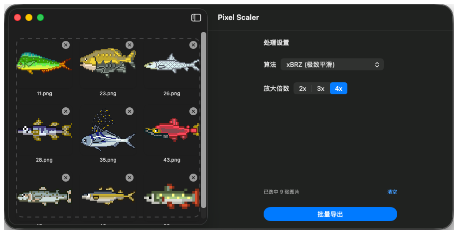
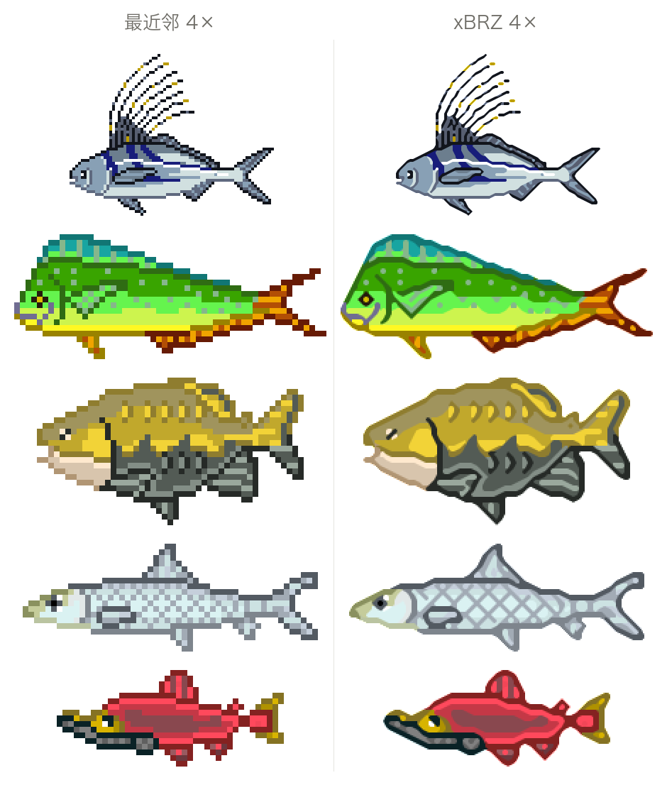
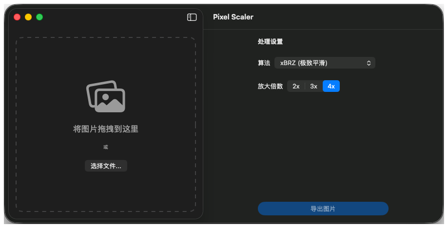

# PixelScaler

一个很小的 macOS 工具：把像素画放大又不糊。拖一堆图进去，选个倍数，选个文件夹，全部导出。

## 为什么做

做桌面水族馆的时候遇到一个问题：鱼是像素画，一张只有 55×22 像素。放到 1920×1080 的屏幕上，最近邻放大就是一堆大方块，系统自带的平滑缩放又会糊成一团。

我想要的是第三种：放大 4 倍，边缘斜着补出来，但整体还是硬的。这正是 xBRZ 这类算法干的事（模拟器放大老游戏画面用的就是它）。可是手边没有顺手的 Mac 工具——能搜到的大多是命令行脚本、Windows 软件，或者要先上传的网页版。

所以就写了一个特别小的东西：**拖一堆图进去，选个倍数，选个文件夹，全部导出。** 没有账号、不用上传、也没有项目文件。

## 关键的取舍

**算法不自己写。** xBRZ 是现成的（Zenju 写的，一千三百多行 C++），我把它整段放进工程直接调用。代价是 xBRZ 是 GPL-3.0 的，跟着它这个工具整体也得按 GPL-3.0 开源——想闭源就只能自己重写一套。

**界面用 SwiftUI，算法用 C++。** 中间隔一层 ObjC++ 的壳（`xBRZWrapper.mm`）加一个 bridging header。代价是多一层要维护的桥；换来的是不用把算法翻成 Swift。

**只给两个选项。** 算法（最近邻 / xBRZ）× 倍数（2x / 3x / 4x）。没有滤镜参数，也没有实时预览。代价是你得导出来才看得到效果；换来的是打开就知道怎么用。

**批量导出，不是单张另存。** 拖一堆进去、选一个文件夹，全部导完，文件名自动带上算法和倍数（`11_xBRZ_4x.png`）。代价是不能单独改某一张的名字。

## 放大之后是什么样

同一批素材，两边都是放大 4 倍：

- **最近邻**：每个像素变成 4×4 的方块，颗粒感很重。想做复古味、或者要求像素严格对齐的时候用它。
- **xBRZ**：照周围颜色补出斜面，边缘平滑，但依然是硬的（不会像双线性那样糊）。角色、精灵图用它。

体积也看得到差别：这 9 张图最近邻一共 15KB，xBRZ 一共 55KB，多出来的就是补进去的那些过渡像素。

## 它是怎么做的

核心其实只有几步：

- **取像素**：NSImage → CGImage → 一块 UInt32 内存，布局是 `premultipliedFirst | byteOrder32Little`。这个布局正好等于 xBRZ 要的 `argb`，算法可以直接吃这块内存，不用逐像素换算。
- **最近邻**：CGContext 里把 `interpolationQuality` 设成 `.none`，画一遍就完事。
- **xBRZ**：一行调用 `xbrz::scale(4, 源, 目标, 宽, 高, ColorFormat::argb)`。
- **导出**：结果重新编码成 PNG 写盘，原图一个字节都不动。

## 界面

左边是虚线框，图拖进去就行，也可以点"选择文件..."。拖进来之后变成网格，每张右上角有个 × 能单独删掉，下面显示文件名；有东西拖过来时整块会亮一下。

右边只有三件事：算法、放大倍数、导出。底下那行写着"已选中 N 张图片"和一个"清空"；按钮文字会跟着变，一张图是"导出图片"，多张就是"批量导出"。

## 现在有什么、没有什么

有的：最近邻 / xBRZ、2x / 3x / 4x、拖拽多选、单独删图、批量导出，同一张图重复拖进来会自动忽略。

还没有的：不能拖文件夹（只认图片文件）；导出是同步跑的，几十张要等一会儿，这期间界面是卡住的，也没有进度条；没有实时预览，选完算法得导出来才看得到区别；没有命令行版本——这个我自己挺想要，能把转换直接塞进构建脚本。

## 谁在用它

桌面水族馆里那些鱼就是这个工具转的：原图 55×22，跑一遍 xBRZ 4x 变成 220×88，再丢进 SpriteKit 当贴图。屏幕上的鱼是平滑的，但没有糊成一团。

## 关于协议

界面和其余代码是我写的，按 [MIT](./LICENSE) 协议开源。

平滑引擎用的是 Zenju 的 [xBRZ](https://sourceforge.net/projects/xbrz/)，GPL-3.0，原封不动放在 `PixelScaler/xBRZ/` 目录里，**不在这份 MIT 协议覆盖的范围内**（细节写在 [NOTICE](./NOTICE)）。因为编译出来的 App 会链接它，分发二进制文件时仍然要遵守 GPL-3.0。

## 回头看

一开始想做一个"像素画工作站"：调色板、切片、动画预览、批量重命名。写到一半发现，我真正需要的只有一件事——**把图放大，而且不要糊**。

还学到一个关于协议的教训：把 GPL 的库链进自己的程序之前，先想清楚它会带来什么。xBRZ 很好用，代价是编译出来的 App 绕不开 GPL——自己的代码可以按 MIT 放出去，整个二进制不行。

> 小工具的价值不在于它能做多少事，而在于你打开它的时候不用想太多。

## 跑起来

- 需要 macOS 14 或更新版本、Xcode 15 以上；打开 `PixelScaler.xcodeproj`，选 `PixelScaler` scheme 运行。
- 三步：拖图片到左边（或点"选择文件..."）→ 右边选算法和倍数 → 点"批量导出"并选一个文件夹。
- 导出的文件名会带上算法和倍数，例如 `11_xBRZ_4x.png`；原图不会被改动。
